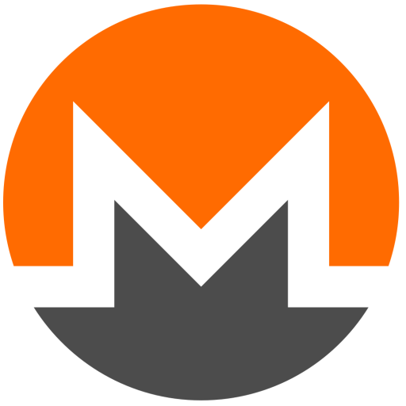

# Mine4aCause POC



The proposal for Mine4aCause is to create a nonprofit organization that creates and manages a tool to engage with the communities of nonprofit organizations where members harnesses their excess browser CPU capacity to mine crypto-currency. All activity would be out in the open with an simple user experience to enable individuals to see the effect of their collective work while controlling the CPU utilization from *none* to *extra-generous*. This idea was inspired by projects like [SETI@home](https://setiathome.berkeley.edu/) and [Folding@home](http://folding.stanford.edu/) with a further desire to put this kind of crypto-mining to serve a greater good.

## The Tool

The proposed tool is a browser extension that will generate hashes against a specific organization's pool. Clearly, a functional website that enables partner organizations to run Mine4aCause campaigns will need to be built should there be enough interest in the project. Until then, this POC focuses on a very minimal Chrome browser plugin that enables Monero generation through [CoinHive](https://coinhive.com) to generate hashes for the CoinHive XMR miner.

This tool can be found in the `background-miner` folder. Instructions on getting started are found in the [Getting Started](#getting_started) section. You'll install the tool in your Chrome browser and it will begin generating hashes for a Monero Pool right away. 

The UI is accessible via the extension bar icon. Clicking on the Chrome icon for the *Mine4aCause POC Extention* will bring up a bare bones interface that identifies the hashing speed, progress and offers a slider to increase or lower the resource use of the extension.

### <a name="getting_started"></a>Getting Started

To load an extension...

1. Start by retrieving the coinhive js files locally; chrome extensions don't like loading things remotely - `$ ./install-js`
1. Load the chrome extension page in your browser: [chrome://extensions](chrome://extensions/)
1. Check `Developer mode` on the top right
1. Click on `Load unpacked extention...` then browse and select the `background-miner` folder to load it
1. Click on the `Enabled` checkbox to enable the extension. 

## Other Tools

During the development of the POX extension, the following were also created.

1. A docker based miner - update the `Dockerfile` with your own public site token (see below for instructions).
1. A simple-ui miner that will load in a page (just load [simple-miner.html](simple-miner.html))
1. A chrome browser extension `simple-miner` that will mine while it is open (follow the same instructions to load the POC extension)

To build and run the docker image...

```bash
$ docker build --rm -t coin-hive
$ docker run --rm coin-hive
```

**NB!** You won't really see tremendous performance out of this since it essentially runs a browser within the container. Update your Docker settings to allow your containers to use more CPU if you would like to get more out of it.

## Future Work

1. Enable the POC to remember its power settings
1. Build a website to demonstrate campaign integration with stats per organization
1. Update the UI
1. Investigate [Coin Hive Stratum](https://github.com/cazala/coin-hive-stratum) as a solution to reducing payment fees.
1. Consider writing an opensource replacement for coinhive.js

## Thanks!

Special thanks to [Jan Cazala](https://github.com/cazala) and his [coin-hive](https://github.com/cazala/coin-hive) project.
